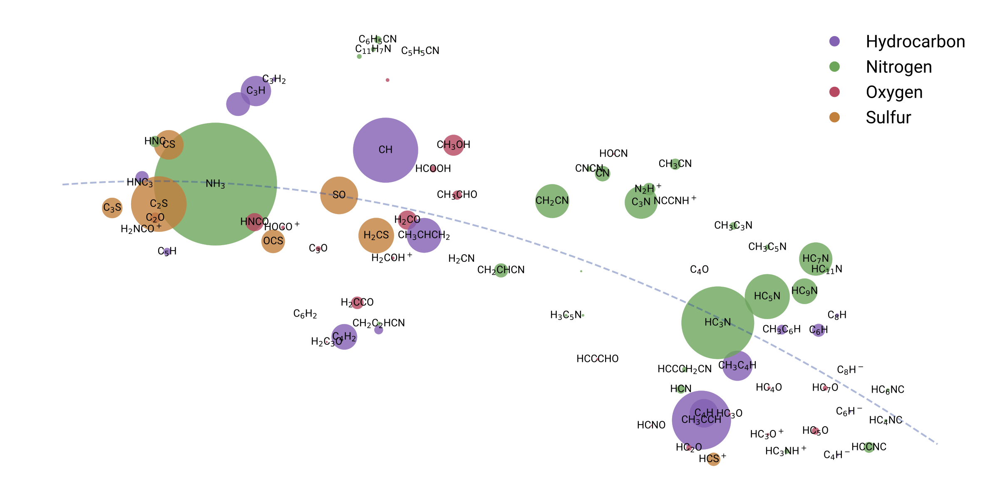

# Unsupervised Molecule Discovery in Astrophysics



## Applying cheminformatics to astrochemistry

This repository includes notebooks and codebase for developing machine learning
pipelines that apply cheminformatics concepts to predicting astrochemical properties.

The current focus is on molecular column densities in astronomical observations,
but can potentially be applied towards laboratory data, as well as studying chemical
networks. As it stands, the code has been tested to work for up to four million
molecules on a Dell XPS 15 (32 GB ram, 6 core i7-9750H) without much difficulty
thanks to frameworks like `dask` that can abstract away a large amount of the
parallelization and out-of-memory operations.

As a point of clarification: "unsupervised" in the title refers to the fact that the
molecule feature vectors are learned using `mol2vec`, which is unsupervised. The
act of predicting column densities requires training a _supervised_ model. I think
the former is more exciting in terms of development than the latter.

If you used the list of recommendations generated from this work as part of your
own observations or work, please cite the Zenodo repository [](https://doi.org/10.5281/zenodo.5080543) and the paper as it comes out.
In the meantime, please cite this repository

## Installation

Currently, the codebase is not quite ready for public consumption: while the
API more or less works as intended, there's still a bit of fussing around with
model training and deploying. If you would like to contribute to this aspect,
please raise an issue in this repository!

The `Makefile` `environment` recipe should recreate the software environment
needed for `umda` to work. Simply run `make environment` to set everything
up automatically.

## Instructions

Currently a user API is underdeveloped, and so if you would like to run your
own predictions it is somewhat manual. As part of the repository, we've included
a pretrained embedding model, as well as a host of regressors stored as `pickle`s
dumped using `joblib`.

Here is an example of the bare minimum code one needs to run the model and
predict the column density of benzene and formaldehyde using linear regression:

```python
from joblib import load
import numpy as np

from umda.data import load_pipeline

# load a wrapper class for generating embeddings
embedder = load_pipeline()
regressors = load("models/regressors.pkl")
# get the gradient boosting regressor
regressor = regressors.get("gbr")

smiles = ["C1=C=C=C=C=C1", "C=O"]
vecs = np.vstack([embedder.vectorize(smi) for smi in smiles])
regressor.predict(vecs)
```

## The full workflow

The pieces of this project are modular, comprising a `word2vec` embedder model
and any given regressor, and the workflow involves putting together these pieces.

### The embedding model

1. Collect up all the SMILES strings you have, and put them into a single `.smi` file. The `scripts/pool_smiles.py` gives an example of this.
2. Train the `mol2vec` model using these SMILES. The `scripts/make_mol2vec.py` shows how this is done.
3. Set up an embedding pipeline: we want to transform SMILES to vectors, an optionally, perform dimensionality reduction. The script `scripts/embedding_pipeline.py` will do this, and serialize a pretrained and convenience class `EmbeddingModel`.

### The regressors

With an embedding pipeline in hand, the next step is to train a regressor to predict whatever astrochemical property you desire. I advise you set up a `.csv` file or other machine readable format that holds all of the molecules and column densities. As part of the regression pipeline, one may also optionally want to perform feature preprocessing, and I recommend setting up a composable `sklearn.pipeline` model. Most of this is done in `notebooks/estimator_training`, and calls on functions in the `umda.data` and `umda.training` modules.

### Generating recomendations

This step doesn't really _need_ trained regressors, but generally you'd be interested in predicting their abundance anyway. The script `scripts/tmc1_recommendations.py` shows how to do this: essentially you compute the pairwise distance of every molecule in your source (TMC-1) and those in your precomputed database of embeddings, and return the closest _unique_ matches. The last step in this script grabs a regressor and predicts the recommendations' column densities. You'll likely need to filter the list to exclude elements you don't think are likely: this is still a pitfall because the distance metric is a reduction of comparisons in high dimensions, and in particular you are likely to end up with things like small diatomic heavy metals (because they are structurally similar to things like CH and CN). Coming up with a semantic model for recommendation wouldn't be too difficult, and is left to the reader 😉

--------

<p><small>Project based on the <a target="_blank" href="https://drivendata.github.io/cookiecutter-data-science/">cookiecutter data science project template</a>. #cookiecutterdatascience</small></p>
This version of the cookiecutter template is modified by Kelvin Lee.

